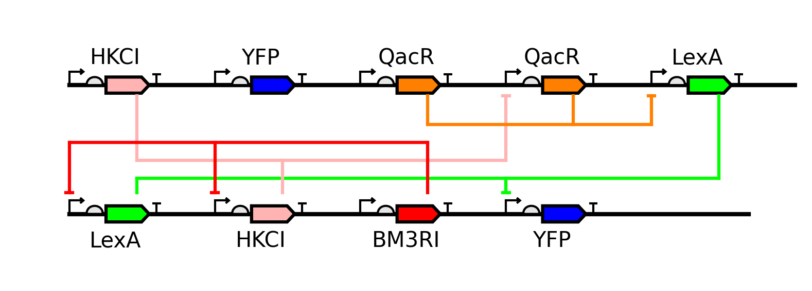
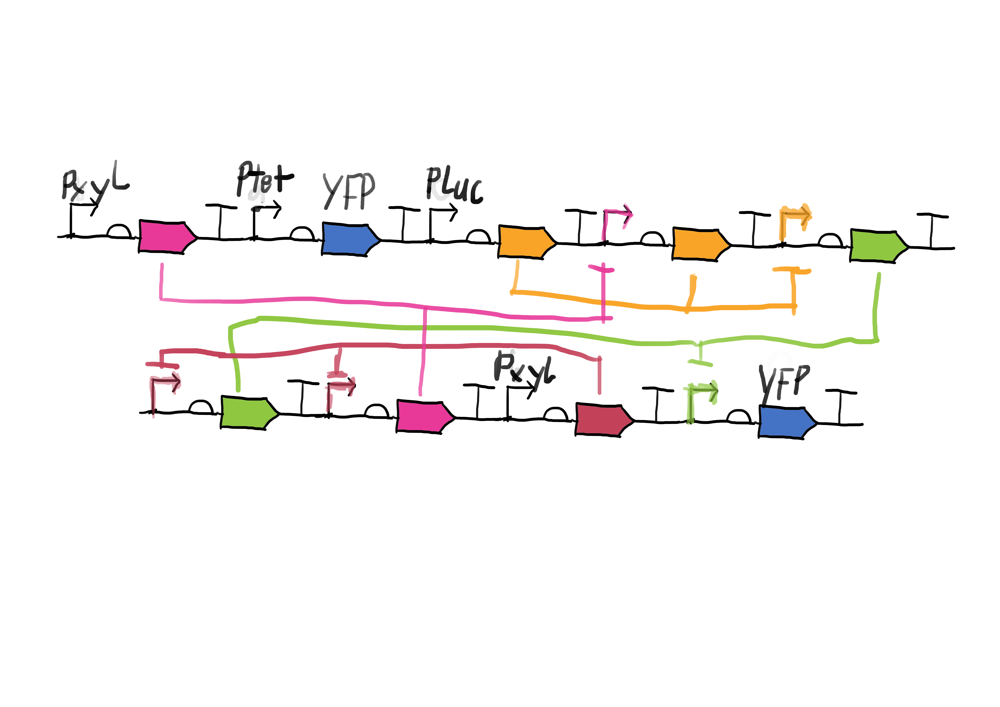

# Plasmid Diagram Generator

This directory contains scripts for generating visual representations of genetic constructs arranged in a plasmid-like layout.

## Overview

The plasmid diagram generator creates clear visualizations of genetic circuits with the following features:
- Genetic elements (promoters, CDS, terminators) displayed in standard SBOL Visual format
- Color-coded regulatory connections between elements
- Smart connection routing to minimize line crossings
- Support for two-row layouts with complex regulatory relationships
## Example Outputs

Here are example diagrams generated by the script:






## Current Limitations

- Not connected to the project codebase in anyway as the module that would supply the plasmid description file has not been implemented
- Colors are currently assigned based on row and position indices (hardcoded)
- Vertical intersections are still possible and the crossings minimizer is not very nice yet
- Promoters are not colored yet
- Added all the parasbolv files as a catalogue not as a submodule coz we only need a small part of it. This is not a good practice

## Key Files

- **plasmid_diagram.py** - Main entry point for diagram generation
- **plasmid_utils.py** - Core utilities for parsing gene descriptions and defining parts
- **plasmid_drawer.py** - Functions for drawing constructs and routing connections
- **plasmid_connection_router.py** - Smart routing of connections between genetic elements
- **plasmid_crossings_minimizer.py** - Algorithms to optimize connection layouts
- **plasmid_data.py** - Example data for testing and demonstration
- **set_path.py** - Ensures correct module imports

## Getting Started

The simplest way to use this package is to run the main script with the included example data:

```bash
python plasmid_diagram.py
```

This will generate a `plasmid_diagram.png` file in the current directory.

## Command Line Options

```bash
python plasmid_diagram.py [--plasmid DATA] [--output FILE] [--show] [--pdf] [--gap PIXELS]
```

- `--plasmid`: Plasmid data (Python structure or file path)
- `--output`: Output filename (default: plasmid_diagram.png)
- `--show`: Display diagram after generation
- `--pdf`: Also save as PDF
- `--gap`: Vertical gap between rows in pixels

## Data Format

The generator expects plasmid data as a list of rows (currently supporting two rows), where each row contains gene descriptions:

```python
[
    [  # Top row genes
        "Gene 0 (P promoter_id -> CDS target_id): P=promoter_type UTR=utr_type CDS=protein_name T=terminator_type",
        # More gene descriptions...
    ],
    [  # Bottom row genes
        # More gene descriptions...
    ]
]
```

Each gene description specifies the regulatory relationship (`P source_id -> CDS target_id`) and the physical parts that make up the gene.


## Programmatic Usage

```python
from plasmid_diagram import create_plasmid_diagram

# Define plasmid data
data = [
    [
        "Gene 0 (P b -> CDS NOR2_6): P=sensor_promoter_Pxyl UTR=utr_Kozak34 CDS=protein_HKCI T=None",
        # More genes...
    ],
    [
        # Bottom row genes...
    ]
]

# Generate diagram
create_plasmid_diagram(data, output_path="my_diagram.png", show=True)